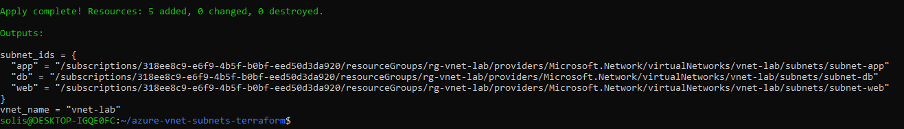
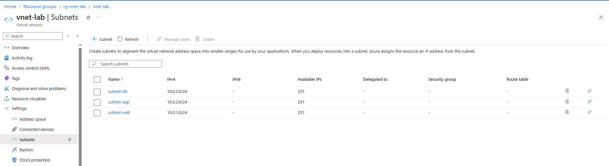

# Azure Virtual Network with Subnets (Terraform)

## 🧾 Overview
This Terraform project creates an Azure Virtual Network (`vnet-lab`) with 3 subnets:
- `subnet-web` (10.0.1.0/24)
- `subnet-app` (10.0.2.0/24)
- `subnet-db` (10.0.3.0/24)

The resources are deployed inside a resource group called `rg-vnet-lab`.

---

## 📁 Project Structure

| File | Purpose |
|------|---------|
| `main.tf` | Declares VNet, subnets, and resource group |
| `variables.tf` | Holds input variables (like names and CIDRs) |
| `outputs.tf` | Prints outputs like subnet IDs and VNet name |
| `provider.tf` | Connects Terraform to Azure using CLI login |
| `screenshots/` | Folder for proof-of-work screenshots |

---

## ⚙️ How to Use

```bash
terraform init
terraform validate
terraform apply -auto-approve
```

✅ Make sure you're logged into Azure CLI first:
```bash
az login
```

---

## 📸 Screenshots

### Terraform Apply Success


### Azure Portal – Subnet View


---

## ✅ Resources Created

- 1 Resource Group: `rg-vnet-lab`
- 1 Virtual Network: `vnet-lab`
- 3 Subnets:
  - `subnet-web`: 10.0.1.0/24
  - `subnet-app`: 10.0.2.0/24
  - `subnet-db`: 10.0.3.0/24

